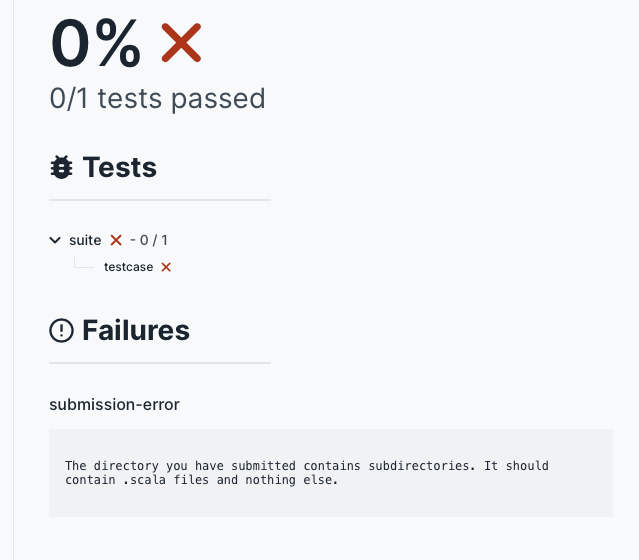

# Unit 0 - Structure of Course and Homework

## Functional Programming

### Introduction

This course is an introduction to functional programming using
the Clojure programming language.  Clojure is a lisp implemented
on the JVM.  My hope, as your instructor, is to show you
enough to make you interested and intrigued.  Even if you don't use
Clojure in your day to day work, understanding more paradigms and
problem solving approaches will make you are more effective problem
solver.

---

### What is Functional Programming?

The answer depends on who you ask.  There are several principles:

  - Programming with functions
  - Recursion
  - Avoiding mutation
  - Avoiding side effects
  - Pure functions
  - Functions as objects
  - Higher order functions

### Why study functional programming?

  - You will need to read programs written using FP languages or FP style 
  - You may work using FP languages
  - High paying and interesting [jobs](https://www.devjobsscanner.com/blog/top-10-highest-paid-programming-languages/), and [jobs](https://www.efinancialcareers.fr/en/news/2023/05/clojure-engineer-jobs-best-paid-programming-language).
  - You can apply FP techniques to imperative languages
  - You need to know lots of techniques to choose the best one.

### Funcational Languages

There are several current and historical functional programming languages:

  - Clojure
  - Scala
  - Common Lisp
  - Haskell
  - Scheme
  - ML
  - OCaml
  - Erlang
  - Elixer
  - F#

---

## Installing Clojure

You'll need to install clojure onto your local machine or laptop.

[Installing](https://clojure.org/guides/install_clojure)

---

## Editors and IDEs

Lots of editor environments are available.  Here is a summary of some.

[Editors](https://clojure.org/guides/editors)

Four interesting ones

### Emacs
[Cider](https://cider.mx)

### Vim
[Various solutions](https://endot.org/2023/05/27/vim-clojure-dev-2023/)

### InteliJ
[Cursive](https://cursive-ide.com)

### VS Code
[Calva](https://calva.io)

---

## Online documentation

[clojure docs](https://clojuredocs.org/clojure.core/defn)

## Clojure web page
[Clojure](https://clojure.org)

---

## Homework
There is a suite of homework programming problems.  Each assignment
has a template and a testcase.  The templates are found in the `src/homework` directory,
and the corresponding tests are founnd in the `test/homework` directory.
You should find all occurances such as

	(throw (ex-info "Missing one or more expressions, not yet implemented" {}))

and

	(throw (ex-info "Missing single expression, not yet implemented" {}))

and replace the `(throw ...)` with valid clojure code which fulfills the requirement
and thus passes the corresponding tests.

### Example

The first homework problem is `Hello`.  Find the file `src/homework/hello.clj`.
In this file you'll find a template function something like the following:

    ;; The purpose of this function it to assure that the student knows
    ;; how to write a basic clojure function, matching parens quotation
    ;; marks etc, and that the student understands how to run the
    ;; test cases provided in the project.
    (defn hello
      "This function computes a String, but does not print it.
      Given a string, who, such as \"Jim\", the function
      computes the string \"Hello, Jim.\", i.e.,
      Beginning with \"Hello\" with a capital H
      then a comma, \",\",
      then a space \" \",
      then the value of who
      and finally a period, \".\""
      [who]
      (throw (ex-info "Missing single expression, not yet implemented" {}))
      )

Your job is to replace `(throw ...)` with an expression which causes the
function to do what the docstring indicates.

You may test your code from the shell using

    sh> cd clojure-student/clojurein-source-code
    sh> lein test homework.hello-test

Or you may also use

    sh> cd clojure-student/clojurein-source-code
    sh> make -f Makefile.test hello

If all the tests pass, the output might look something like this.

    Testing homework.hello-test

    Ran 5 tests containing 100 assertions.
    0 failures, 0 errors.

If some of the tests fail, the output might look something like this.

    Testing homework.hello-test

    ERROR in (t-trivial) (hello.clj:18)
    trivial
    expected: (= (sut/hello "") "Hello, .")
      actual: clojure.lang.ExceptionInfo: Missing single expression, not yet implemented
    {}
     at homework.hello$hello.invokeStatic (hello.clj:18)
        homework.hello$hello.invoke (hello.clj:8)
        homework.hello_test$fn__511$fn__512$fn__513.invoke (hello_test.clj:33)
        homework.hello_test$fn__511$fn__512.invoke (hello_test.clj:33)
        common.util$call_with_timeout$fn__408.invoke (util.clj:87)
        clojure.core$binding_conveyor_fn$fn__5823.invoke (core.clj:2047)
    ...

## Submitting homework assignments

You may complete the homework problems in any order, but the recommended order
is top to bottom on the Forge/intranet page.

Once your code passes the tests you should copy your implementation, e.g., `hello.clj`
to the top level directory of your intra submission git repo e.g., 
`epita-ing-2024-clojurein-pierre.dupont/.`.

The top level directory should look like this, with some or all of the
following files.

    binarysearch.clj  frenchnames.clj  recursion.clj   theg.clj
    cakecutting.clj   hello.clj        reduce.clj      trig.clj
    factors.clj       polynomial.clj   runaverage.clj  triptych.clj

If the tests pass, you'll see something like the following on the Forge/intra page.

If the tests fail, you'll be able to see the failure message.

## Final Grade for the course

Your final grade for the course will be computed from the submitted assignments.
Each assignment counts the same, even though some assignments are easy and some are
difficult.  Your grade for each assignment is the percentage of tests passed.
Your grade for the course is the average percentage over all the tests.

To receive a 20/20 for the course, you must complete all assignments with 100% score 
on each.
