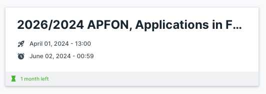

# Unit 0 - Structure of Course and Homework

## Homework
There is a suite of homework programming problems.  Each assignment
has a template and a testcase.  The templates are found in the `src/homework` directory
and the corresponding tests are founnd in the `test/homework` directory.
You should find all occurances such as
```
(throw (ex-info "Missing one or more expressions, not yet implemented" {}))
```
and
```
(throw (ex-info "Missing single expression, not yet implemented" {}))
```
and replace the `(throw ...)` with valid clojure code which fulfills the requirement
and thus passes the corresponding tests.


### Example

The first homework problem is `Hello`.  Find the file `src/homework/hello.clj`.
In this file you'll find a template function something like the following:
```
;; The purpose of this function it to assure that the student knows
;; how to write a basic clojure function, matching parens quotation
;; marks etc, and that the student understands how to run the
;; test cases provided in the project.
(defn hello
  "This function computes a String, but does not print it.
  Given a string, who, such as \"Jim\", the function
  computes the string \"Hello, Jim.\", i.e.,
  Beginning with \"Hello\" with a capital H
  then a comma, \",\",
  then a space \" \",
  then the value of who
  and finally a period, \".\""
  [who]
  (throw (ex-info "Missing single expression, not yet implemented" {}))
  )
```

Your job is to replace `(throw ...)` with an expression which causes the
function to do what the docstring indicates.

You may test your code from the shell using
```
sh> cd clojure-student/clojurein-source-code
sh> lein test homework.hello-test
```


## Submitting homework assignments

You may complete the homework problems in any order, but the recommended order
is top to bottom on the Forge/intranet page.



Once your code passes the tests you should copy your implementation, e.g., `hello.clj`
to your intra submission git repo e.g., `epita-ing-2024-clojurein-pierre.dupont`.


